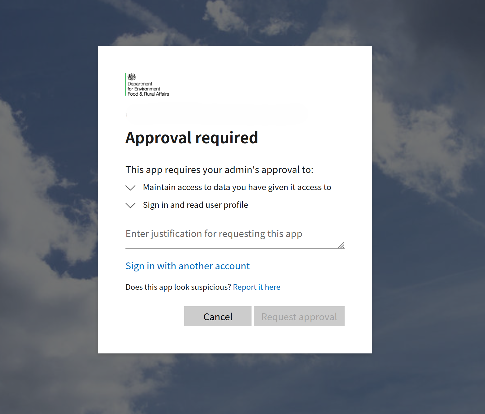

# Microsoft Entra

Microsoft Entra is a cloud-based identity and access management service that helps organizations manage user identities and control access to resources. It provides features such as single sign-on (SSO), multi-factor authentication (MFA), and conditional access policies to enhance security and streamline user access to applications and services.

FCP services should use Microsoft Entra for authentication and authorization of internal users.

## Example

An example repository has been created to demonstrate how to implement Microsoft Entra in an FCP service.  The repository can be found [in GitHub](https://github.com/DEFRA/fcp-entra-example)

## App Registration

An Azure App Registration is created to represent the application in Microsoft Entra. This registration includes information about the application, such as its name, redirect URIs, and permissions.

### Naming convention

App Registrations should follow a naming convention that is consistent and descriptive and should include the environment.

For example:

- `FCP-Payments-Dev`
- `FCP-Payments-Prod`

## Permissions

Permissions can be added to the App Registration and subsequently users can be placed in those roles.  This allows for a more granular control of access to the application.

Permissions should follow the principle of least privilege, meaning that users should only be granted the permissions necessary to perform their job functions.

### Naming convention

Permissions should follow a naming convention that is consistent and descriptive and follow a dot notation format.

For example:

- `FCP.Payments.View`
- `FCP.Payments.Create`

## Credentials

Internal users will authenticate using their organisation Microsoft account.  No new credentials need to be created specifically for FCP services.

For those without a Defra Microsoft account, a `@defra.onmicrosoft.com` account can be used.

## Tenants

Defra has two Microsoft Entra tenants that require the App Registration to be created in.

### O365_DEFRADEV

The `O365_DEFRADEV` tenant is used for proof of concept work and is a pre-requisite environment for Production use.

Teams must prove their setup in the `O365_DEFRADEV` tenant.

Teams can request a new App Registration including permission setup for this tenant through a [ServiceNow ticket](https://defragroup.service-now.com/esc?id=sc_cat_item&table=sc_cat_item&sys_id=496b9d931b2cce90848b8594e34bcbe5&recordUrl=com.glideapp.servicecatalog_cat_item_view.do%3Fv%3D1&sysparm_id=496b9d931b2cce90848b8594e34bcbe5).

### Defra

Once the proof of concept work has been completed, the App Registration can be created in the `Defra` tenant.

Any changes to the `Defra` tenant require a change request.

A series of standard changes exist to support the creation of the App Registration as well as **some** of the common subsequent tasks.

Teams can decide whether to use these standard changes or to raise a bespoke normal change to cover all activities.

The following [ServiceNow standard change for a Type 1 registration](https://defragroup.service-now.com/change_request.do?sys_id=-1&sysparm_query=chg_model%3de55d0bfec343101035ae3f52c1d3ae49%5estd_change_producer_version%3d82d5c19247f17110c962fa7c736d4330&sysparm_link_parent=d401364f1b7861101fd8337f034bcbf9&sysparm_catalog=e0d08b13c3330100c8b837659bba8fb4&sysparm_catalog_view=catalog_Service_Catalog&sysparm_view=catalog_Service_Catalog) can be used to create the App Registration.

It is recommended to create at least two App Registrations in the `Defra` tenant, one for Production and one for Non-Production.  

This allows users to be placed in roles to support lower environment testing without risking access to Production data.

#### Permissions

Once the App Registration has been created, the permissions can be added to the App Registration through [a further standard change](https://defragroup.service-now.com/change_request.do?sys_id=-1&sysparm_query=chg_model%3de55d0bfec343101035ae3f52c1d3ae49%5estd_change_producer_version%3d1a3c71123b128ad80a9d0d3a85e45af2&sysparm_link_parent=d401364f1b7861101fd8337f034bcbf9&sysparm_catalog=e0d08b13c3330100c8b837659bba8fb4&sysparm_catalog_view=catalog_Service_Catalog&sysparm_view=catalog_Service_Catalog)

Users can be added to the roles through [a further standard change](https://defragroup.service-now.com/change_request.do?sys_id=-1&sysparm_query=chg_model%3de55d0bfec343101035ae3f52c1d3ae49%5estd_change_producer_version%3dd58d0d9c83771a947b3f5a80ceaad34c&sysparm_link_parent=d401364f1b7861101fd8337f034bcbf9&sysparm_catalog=e0d08b13c3330100c8b837659bba8fb4&sysparm_catalog_view=catalog_Service_Catalog&sysparm_view=catalog_Service_Catalog)

> Project teams typically support the management of their own permissions initially, but longer term, access requests will be managed through the business through ServiceNow.

#### App registration approval

Once the App Registration has been created, it must be approved by CCoE before it can be used in Production.

Until it is services will receive the following message when attempting to use the App Registration.

> There does not seem to be a standard change for this approval process, so teams should engage with CCoE to discuss how to request this approval.

## FCP Platform

For services deployed to the FCP Platform, instead of creating the new App Registration in the `Defra` tenant, the App Registration should be created in the following tenants for each environment:

- `DefraCloudDev` for the `Development` and `Test` FCP Platform environments
- `DefraCloudPreProd` for the `Pre-Production` FCP Platform environment
- `DefraCloud` for the `Production` FCP Platform environment

Due to the increased number of tenants utilised by the FCP Platform, there is no need to create multiple App Registrations in a single tenant as Production is already isolated.

## Configuration rotation

App Registration credentials expire after a set period of time.  This is typically 1 or 2 years.

These credentials should be rotated before they expire and the application reconfigured to use the new credentials.
