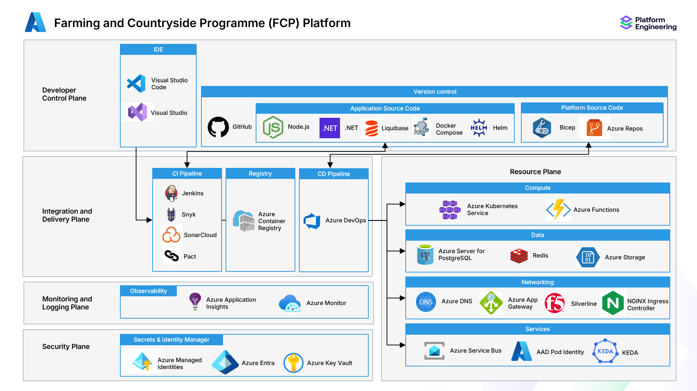

# Platform

## Platform engineering

To support rapid, highly assured delivery, FCP follows the principles of [Platform Engineering](https://platformengineering.org/blog/what-is-platform-engineering) to deliver common capabilities.

## FCP Platform

FCP was the first Defra programme to adopt this approach and the FCP Platform engineering team has delivered common Azure environments, PaaS components, delivery pipelines and supporting tools.

These are collectively referred to as the `FCP Platform`.

## Core Delivery Platform (CDP)

In recent years, the [Core Delivery Platform (CDP)](https://github.com/DEFRA/cdp-documentation) has emerged as Defra's strategic platform engineering product.

It is the expectation that all new services will be delivered using CDP.

The majority of existing services will be migrated to CDP and the FCP Platform will be scaled down.

## Azure Development Platform (ADP)

The [Azure Development Platform (ADP)](https://defra.github.io/adp-documentation/) was developed as an alternative to CDP and is essentially an iteration of the FCP Platform.

ADP is to be decommissioned and all projects will be migrated to CDP.

## Choosing a platform

All teams should develop new services and components on CDP.

Teams currently utilising FCP Platform should assess how to migrate existing capabilities to CDP.

No new capabilities should be added to FCP Platform or ADP.

## FCP Platform

### Reference architecture

### Hosting

The FCP Platform is hosted on Azure in the North Europe region (Dublin, Ireland).

Subscriptions are split across three tenants, `DefraCloudDev`, `DefraCloudPreProd` and `DefraCloudProd`.

### Environments

#### Sandpit 1

The `Sandpit 1` environment is used for experimentation and supporting local development.

Developers have a high level of access to the Sandpit environment to create and destroy resources as required.

Unlike all subsequent environments, provisioning of Azure resources such as Managed Identities, PostgreSQL is not automated.  Teams must create their own resources in this environment using the guides in this repository.

Although the majority of patterns between `Sandpit 1` and higher environments are the same, a key difference is the use of [Azure App Configuration](https://docs.microsoft.com/en-us/azure/azure-app-configuration/overview) for configuration management and the use of Jenkins for any deployments.

The reason for this is that originally all environments used Azure App Configuration, however automation of configuration from an [Azure repo](https://dev.azure.com/defragovuk/DEFRA-FFC/_git/DEFRA-FFC-PLATFORM) has replaced this in all other environments.

The `Sandpit 1` environment is in the `DefraCloudDev` tenant.

#### Sandpit 2

The `Sandpit 2` environment is the first automation only deployment environment for new services following merge to the `main` branch.  It also hosts dynamic feature branch deployments.
Different teams utilise it for many purposes such as demonstrations and testing.

It is intended as a replacement for the `Sandpit 1` environment.

Developers have full access to this environment, but cannot directly create or destroy resources.  Instead, they must use the automation provided to deploy their services.

The Development environment is in the `DefraCloudDev` tenant.

#### Development

Like `Sandpit 2`, the `Development` is utilised in a flexible way by teams.

Developers have full access to this environment, but cannot directly create or destroy resources.  Instead, they must use the automation provided to deploy their services.

The Development environment is in the `DefraCloudDev` tenant.

#### Test

The `Test` environment is used for more formal testing and assurance activities such as integration testing and user acceptance testing.

> Note: FCP principles are to apply a "shift left" approach to testing where as much testing as possible is done during development prior to merging to `main`, as well as a principle of deploying frequent small changes to `Production`.
> Therefore, it is not expected that changes build up in `Test` ahead of a large scale deployment to higher environments.  For incomplete features or those awaiting wider scale testing, feature toggles are used to disable new behaviour and not block deployment through to `Production`.

Developers have full access to this environment, but cannot directly create or destroy resources.  Instead, they must use the automation provided to deploy their services.

> Note: Development and Test share the same subscription and PaaS resources.

The Test environment is in the `DefraCloudDev` tenant.

#### Pre-Production

The `Pre-Production` environment is used as a staging area prior to deployment to `Production`.  Whilst some testing activities can be performed here, it is recommended to use `Test` for most testing activities as access to this environment is more restricted and requires Security Clearance.

Developers with Security Clearance can request read only access to this environment.

The Pre-Production environment is in the `DefraCloudPreProd` tenant.

#### Production

The `Production` environment is the live environment for the service.  It is the only environment that is accessible to the public.

Developers with Security Clearance can request read only access to this environment.

The Production environment is in the `DefraCloudProd` tenant.
