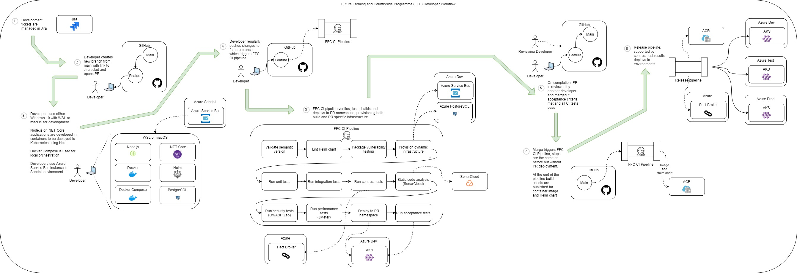

# Route to live
Teams across the FFC programme follow the below core workflow.

Individual delivery teams are free to add their own processes on top of these core values to best fit their context.

## Process for change
This applies equally to a new feature or bug fix.

1. developer creates a feature branch from main branch
2. developer creates an empty commit with the title of the change and a link to Jira ticket
3. developer opens draft PR for change
4. developer changes semantic version of application
5. developer write code in line with team standards, following TDD where appropriate
6. as developer commits, CI builds and deploys to isolated PR environment
7. CI runs tests to assure code quality
8. when ready, code is reviewed using PR deployment and CI outputs to support
9.  if review passes code is merged to main branch
10. CI automatically tears down PR deployment
11. CI packages, versions and prepares for deployment to higher environments
12. pipeline automatically deploys to Sandpit and Development environments sequentially
13. developer approves deployment to Test environment
14. developer raises ticket with CCoE to deploy to PreProduction environment
15. developer prepares run book for PreProduction deployment
16. CCoE approves deployment to PreProduction environment
17. developer raises change request within myIT to deploy to Production environment
18. developer prepares run book for Production deployment
19. CCoE approves deployment to Production environment

## Environments

## Shift left

Teams should follow a [shift left](https://en.wikipedia.org/wiki/Shift-left_testing) approach to testing where as much testing is performed as early as possible in the development process.  The [FFC CI pipeline](ci-pipeline.md) with it's dynamic infrastructure provisioning and test execution is a key enabler of this approach.

Test environments are primarily used for end to end, user acceptance and performance testing that are typically not possible earlier.

## Data

Production is the only environment where "real" data is permitted.  All other environments should use synthetic data.
